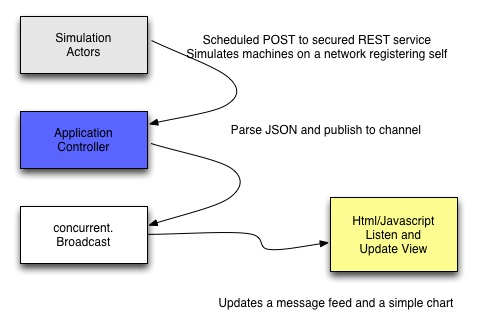

ImAlive
=============

A sample reactive Play 2.1 application 

About
--------------

This sample simulates network machines POSTing a status to a service

Some history
--------------

* Supports Activator 0.3.0
* This sample was modeled after 2 projects: the Activator sample, Reactive Stocks and **[SSE-Chat](https://github.com/matthiasn/sse-chat)**
* This sample is provided under the Apache 2 license.
 
My blog post on first encounter with Activator:

http://processor44.blogspot.com/2013/07/go-typesafe-activator.html
 

This sample uses
--------------

* Twitter Bootstrap 
* JQuery
* Coffee Script  http://coffeescript.org/
* FlotCharts http://www.flotcharts.org/flot/examples/
* AngularJs 1.1
* Scala 2.10.2
* Playframework 2.1.3
* Akka 2.2.0
* TODO Google BigQuery

